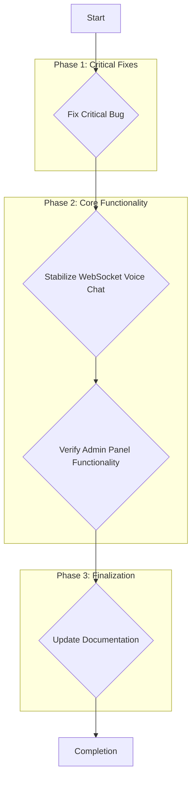

# Implementation Summary and Roadmap

This document outlines the current status of the Newomen Mental Health Platform, identifies critical issues and implementation gaps, and provides a clear roadmap for completing the project.

## Current Status

The project is well-architected, with a strong foundation for the core feature: a real-time, AI-powered voice conversation system that strictly adheres to admin-defined prompts.

### Strengths
- **Comprehensive Documentation**: The `README.md` and `REALTIME_CONVERSATION_ADMIN_COMPLIANCE.md` files provide excellent context.
- **Robust Prompt Management**: The `promptStore` is well-designed to manage and enforce admin-defined prompts, which is a critical compliance feature.
- **Solid UI Foundation**: The `RealtimeVoiceChat.jsx` component correctly implements the core logic for session management and prompt enforcement.
- **Clear Technical Stack**: The project consistently uses React, Vite, Tailwind CSS, and Zustand.

### Identified Gaps and Issues
1.  **Critical Bug in `aiProviderStore.js`**: A duplicate `apiKey` property with an empty string is overriding the actual key, making API calls impossible.
2.  **Incomplete WebRTC Implementation**: The WebRTC connection logic in `realtimeAgent.js` is a stub and relies on a non-existent signaling server.
3.  **Admin Panel Functionality Unverified**: The UI components for the admin dashboard exist, but their connection to the state management stores (`promptStore`, `aiProviderStore`) has not been verified.
4.  **Missing System Prompt Integration in `realtimeAgent.js`**: The `buildSystemPrompt` method contains a placeholder and does not fully integrate the admin prompts at the service level.

## Completion Roadmap

The following steps will be taken to address the identified issues and complete the implementation.

### Detailed Plan

1.  **Fix Critical Bug in `aiProviderStore.js`**:
    *   **File to Modify**: `src/store/aiProviderStore.js`
    *   **Action**: Remove the duplicate, empty `apiKey` property from the `defaultProviders` array to ensure the correct API key is used.

2.  **Stabilize and Verify WebSocket Voice Chat**:
    *   **Focus**: Ensure the primary voice chat functionality is robust and fully compliant.
    *   **Files to Review**: `src/services/realtimeAgent.js`, `src/components/chat/RealtimeVoiceChat.jsx`.
    *   **Action**: Enhance the `buildSystemPrompt` method in `realtimeAgent.js` to directly incorporate the admin prompts, making the service more self-contained. Thoroughly test the end-to-end voice session flow using the WebSocket transport.

3.  **Verify Admin Panel Functionality**:
    *   **Focus**: Ensure administrators can effectively manage prompts and AI providers.
    *   **Files to Review**: All components under `src/components/admin/`.
    *   **Action**: Trace the data flow from the admin UI components to the `promptStore` and `aiProviderStore` to confirm that creating, updating, and deleting prompts and providers works as expected.

4.  **Update Documentation**:
    *   **Focus**: Accurately reflect the current state of the implementation.
    *   **Files to Modify**: `README.md`, `REALTIME_CONVERSATION_ADMIN_COMPLIANCE.md`.
    *   **Action**: Update the `README.md` to clarify that WebRTC is a future enhancement and not part of the current, stable implementation. Add a note about the importance of the admin panel for configuration.

Once these steps are completed, the platform will have a fully functional and polished core implementation, ready for further testing and deployment.